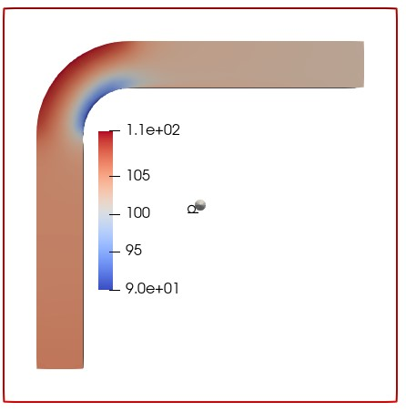
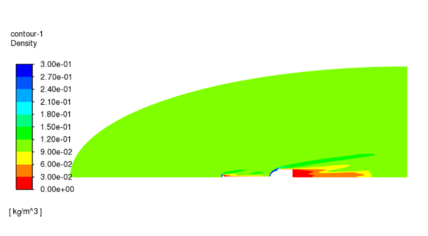

# CFD & CAE Engineering Portfolio

Welcome to my engineering simulation portfolio.

This repository contains selected projects demonstrating practical experience in **Computational Fluid Dynamics (CFD), compressible and incompressible flow, turbulence modelling, meshing, numerical simulation, post-processing, and engineering analysis**.

The portfolio includes both **open-source CFD workflows** and **ANSYS Fluent simulations**, with emphasis on understanding the physical problem, selecting appropriate numerical models, troubleshooting solver behaviour, and interpreting simulation results.

---

# Projects

## 1. Open-Source CFD Analysis of Flow Through a 90° Pipe Elbow

An end-to-end CFD project demonstrating a completely open-source engineering workflow:

**FreeCAD → SALOME → OpenFOAM → ParaView**

The project includes:

* CAD geometry creation
* CFD mesh generation
* OpenFOAM simulation setup
* Pressure and velocity post-processing
* Flow development through a 90° bend
* Engineering interpretation of internal-flow behaviour



**Tools:** FreeCAD · SALOME · OpenFOAM · ParaView

[View Full Project →](projects/Open_Source_CFD_Analysis/README.md)

---

## 2. OpenFOAM Turbulence Model Comparison — k-ε vs k-ω SST

A comparative CFD study using the OpenFOAM **pitzDaily** benchmark to investigate the influence of turbulence-model selection on separated turbulent flow.

The study compares:

* k-ε turbulence model
* k-ω SST turbulence model
* Velocity distributions
* Flow separation and recirculation
* Differences in model predictions
* Engineering implications of turbulence-model selection


**Tools:** OpenFOAM · ParaView · RANS Turbulence Modelling

[View Full Project →](projects/Turbulence_model_comparison/README.md)

---

## 3. Hypersonic Aerospike CFD — Mach 6.06

A **2D axisymmetric hypersonic CFD benchmark study** of flow over a spiked blunt body using **ANSYS Fluent 2022 R1**.

The simulation reproduces the freestream conditions of the Model 1 aerospike benchmark reported by Roveda:

* **Mach number:** 6.06
* **Static pressure:** 1951 Pa
* **Static temperature:** 58.25 K

The project focuses particularly on the practical numerical considerations required for stable high-speed compressible CFD.

Key aspects include:

* Density-based implicit solver
* 2D axisymmetric formulation
* Pressure far-field boundary conditions
* Ideal-gas density
* Sutherland temperature-dependent viscosity
* SST k-ω turbulence modelling
* Courant-number control
* Solver-divergence diagnosis
* Laminar-to-turbulent solution initialisation
* Adaptive Mesh Refinement (AMR)
* Residual and aerodynamic-monitor assessment



An important part of this study was troubleshooting an initially diverging Mach 6 solution. A stable solution procedure was obtained by reducing the Courant number to **0.1**, establishing the compressible flow field first with a laminar calculation, and subsequently activating the SST k-ω turbulence model.

The project is currently presented as a **benchmark reproduction and learning study**, with additional quantitative validation and post-processing planned.

**Tools:** ANSYS Fluent · Hypersonic CFD · Compressible Flow · SST k-ω · AMR

[View Full Project →](projects/Hypersonic_Aerospike_Fluent/README.md)

---

# Technical Skills Demonstrated

## Computational Fluid Dynamics

* Internal and external flow simulation
* Incompressible and compressible CFD
* Hypersonic flow modelling
* Steady-state simulations
* Flow separation and recirculation
* Shock-wave and expansion-flow physics
* Pressure and velocity analysis
* Numerical convergence assessment
* Solver troubleshooting and stabilisation

## Turbulence Modelling

* Reynolds-Averaged Navier–Stokes (RANS)
* k-ε turbulence model
* k-ω SST turbulence model
* Turbulence-model comparison
* Turbulence initialisation
* Separated turbulent flows

## High-Speed CFD

* Density-based compressible solvers
* Axisymmetric CFD
* Pressure far-field boundary conditions
* Ideal-gas modelling
* Temperature-dependent viscosity using Sutherland's law
* Operating-pressure selection
* Courant-number control
* Shock-containing flows
* Adaptive Mesh Refinement

## OpenFOAM

* CFD case setup
* Boundary-condition configuration
* Turbulence-model selection
* Mesh import and preparation
* Simulation execution
* Result interpretation

## ANSYS Fluent

* Density-based implicit solver
* Compressible-flow setup
* Axisymmetric modelling
* Energy equation
* SST k-ω turbulence
* Pressure far-field boundaries
* Adaptive Mesh Refinement
* Solver monitoring and convergence troubleshooting

## CAD & Meshing

* FreeCAD
* SALOME
* Geometry preparation
* CFD mesh generation
* Boundary identification
* Local mesh refinement

## Post-Processing

* ParaView
* ANSYS Fluent
* Pressure contours
* Velocity visualisation
* Density contours
* Residual monitoring
* Aerodynamic-monitor plots
* CFD result interpretation

---

# Engineering Workflow

The projects in this portfolio generally follow the engineering simulation workflow:

```text
Problem Definition
        ↓
Geometry Preparation
        ↓
Meshing
        ↓
Physics & Boundary Conditions
        ↓
Solver Setup
        ↓
Simulation
        ↓
Convergence Assessment
        ↓
Post-Processing
        ↓
Engineering Interpretation
```

A particular emphasis is placed on understanding **why specific modelling and numerical choices are made**, rather than treating CFD purely as a software workflow.

---

# Software & Tools

### CFD Solvers

`OpenFOAM` · `ANSYS Fluent`

### CAD & Meshing

`FreeCAD` · `SALOME`

### Post-Processing

`ParaView` · `ANSYS Fluent`

### CFD Methods

`RANS` · `k-ε` · `k-ω SST` · `Compressible Flow` · `Hypersonic CFD` · `Axisymmetric CFD` · `AMR`

---

# About This Portfolio

The objective of this repository is to document selected engineering simulation studies with emphasis on:

* Clear CFD methodology
* Appropriate physical modelling
* Numerical-method understanding
* Reproducible workflows
* Solver troubleshooting
* Engineering interpretation of results
* Experience with both open-source and commercial CFD tools
* Continuous development of practical CAE/CFD skills

The projects range from introductory benchmark studies to more specialised high-speed-flow simulations.

Additional CFD and CAE studies will be added progressively.

---

# Repository Structure

```text
CFD-CAE-Portfolio/
│
├── README.md
│
└── projects/
    │
    ├── Open_Source_CFD_Analysis/
    │   ├── README.md
    │   ├── Geom.FCStd
    │   ├── Geom-Sweep.step
    │   ├── Mesh_3.unv
    │   ├── P.jpg
    │   ├── U.jpg
    │   └── elb.pvsm
    │
    ├── Turbulence_model_comparison/
    │   ├── README.md
    │   ├── pitzDaily_eps.7z
    │   ├── pitzDaily_omega.7z
    │   └── k-omega vs k-epsilon.jpg
    │
    └── Hypersonic_Aerospike_Fluent/
        ├── README.md
        ├── Density.PNG
        ├── residuals.png
        └── drag_monitor.png
```

---

## Portfolio Focus

**CFD · CAE · OpenFOAM · ANSYS Fluent · Compressible Flow · Hypersonic CFD · Turbulence Modelling · Meshing · Post-Processing**

---

**More CFD and CAE projects will be added as the portfolio develops.**
