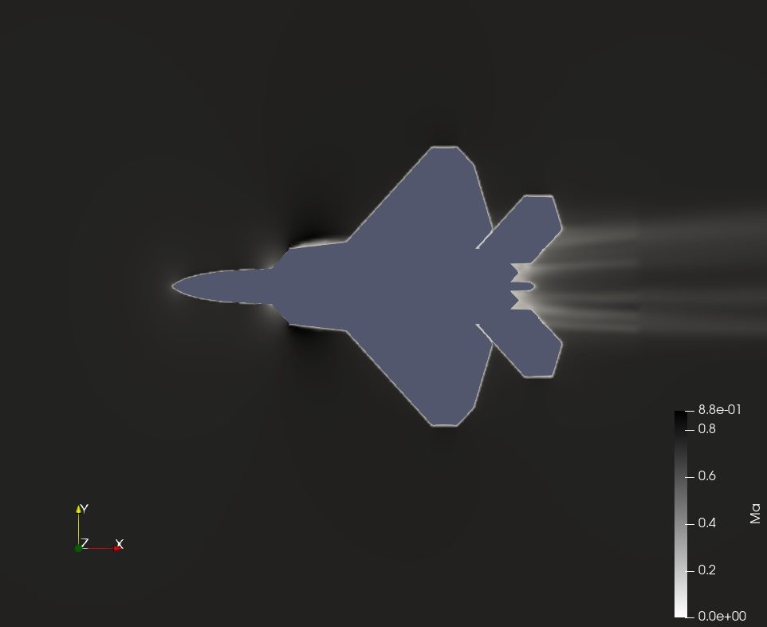

# 3D Fighter Aircraft External Aerodynamics — OpenFOAM

## Overview

This project presents a **3D compressible external-aerodynamics simulation of a fighter-aircraft geometry** using **OpenFOAM**.

The case extends the aerodynamic CFD workflow from two-dimensional aerofoil analysis to a full three-dimensional geometry. The main focus was gaining practical experience with **3D `snappyHexMesh` meshing, nested refinement regions, compressible RANS modelling, parallel decomposition, and post-processing of the Mach-number field**.

> **Project origin:** This is a guided learning project completed as part of the **FlowThermoLab – CFD of High-Speed Aerodynamics** course. Credit for the original tutorial framework and educational material belongs to FlowThermoLab and the respective course instructors. The case was executed, inspected, and post-processed by me to develop practical skills in 3D OpenFOAM aerodynamics.

---

## Case Summary

| Parameter              |                              Value |
| ---------------------- | ---------------------------------: |
| Geometry               |  3D fighter-aircraft configuration |
| Flow type              | Compressible external aerodynamics |
| Solver                 |                    `rhoSimpleFoam` |
| Simulation             |                       Steady-state |
| Freestream Mach number |                             ~0.729 |
| Freestream velocity    |                         ~233.6 m/s |
| Angle of attack        |                             ~2.79° |
| Static pressure        |                         108,988 Pa |
| Freestream temperature |                          255.556 K |
| Turbulence model       |                            k-ω SST |
| Equation of state      |                        Perfect gas |
| Dynamic viscosity      |                   1.63 × 10⁻⁵ Pa·s |
| Final mesh             |                ~3.31 million cells |
| Meshing                |      `blockMesh` + `snappyHexMesh` |
| Parallel decomposition |                      32 subdomains |
| CFD software           |                     OpenFOAM v2412 |
| Post-processing        |                           ParaView |

---

## 3D Geometry

The aerodynamic body is supplied to OpenFOAM as an STL surface:

```text
fighter.stl
```

Unlike a two-dimensional aerofoil case, this simulation resolves the flow around the complete three-dimensional aircraft configuration.

This introduces additional aerodynamic features associated with:

* Swept lifting surfaces
* Wing-tip effects
* Three-dimensional pressure gradients
* Flow interaction between different parts of the aircraft
* Downstream wake development

---

## Computational Domain

A large three-dimensional far-field domain was initially generated using OpenFOAM's `blockMesh`.

The background domain extends approximately:

```text
X: -69 m to 151 m
Y: -50 m to 50 m
Z: -50 m to 50 m
```

The initial background mesh consists of:

```text
44 × 20 × 20
```

cells before the subsequent `snappyHexMesh` refinement process.

A sufficiently large external domain is important to reduce the influence of the outer boundaries on the aerodynamic solution around the aircraft.

---

## Mesh Generation

The most important part of this exercise was the **3D meshing workflow using `snappyHexMesh`**.

The procedure consists of:

```text
fighter.stl
      ↓
surfaceFeatureExtract
      ↓
blockMesh
      ↓
snappyHexMesh
      ↓
Castellation
      ↓
Surface & Volume Refinement
      ↓
Snapping
      ↓
Boundary-Layer Addition
      ↓
Final 3D CFD Mesh
```

### Feature Extraction

Sharp geometric features were extracted from the STL surface using:

```text
surfaceFeatureExtract
```

The resulting feature mesh:

```text
fighter.eMesh
```

was subsequently used by `snappyHexMesh` to improve the representation of sharp aircraft edges.

The explicit feature-refinement level was set to:

```text
Level 7
```

---

## Surface Refinement

The aircraft surface was refined using:

```text
level (6 7)
```

This provides significantly finer cells close to the fighter geometry compared with the background domain.

The refinement is particularly important around:

* Leading edges
* Trailing edges
* Wing surfaces
* Fuselage
* Sharp geometric features

where stronger aerodynamic gradients are expected.

---

## Nested Volumetric Refinement

Three progressively larger refinement boxes were used around the aircraft.

### Refinement Region 1

```text
Refinement level: 6
```

This is the finest volumetric refinement region surrounding the aircraft.

### Refinement Region 2

```text
Refinement level: 5
```

This region extends further downstream and around the aircraft.

### Refinement Region 3

```text
Refinement level: 4
```

The largest refinement region provides additional resolution through the surrounding flow field and downstream wake.

Using nested refinement regions allows high resolution to be concentrated where it is most useful while avoiding unnecessary refinement throughout the complete far-field domain.

---

## Boundary-Layer Mesh

Boundary-layer addition was enabled in `snappyHexMesh`.

The fighter surface uses:

```text
Number of surface layers = 4
Expansion ratio = 1.2
Final layer thickness = 0.3
```

The purpose of these layers is to improve resolution of the flow close to the aircraft surface.

The final generated mesh contains approximately:

## **3,309,334 cells**

This project therefore provided useful experience working with a significantly larger **3D OpenFOAM mesh** compared with simpler two-dimensional aerodynamic cases.

---

## Flow Model

### Compressible Air

Air was treated as a **perfect gas** using OpenFOAM's compressible thermophysical formulation.

The model uses:

* Perfect-gas equation of state
* `Cp = 1005 J/(kg·K)`
* Dynamic viscosity = `1.63 × 10⁻⁵ Pa·s`
* Prandtl number = `0.72`
* Sensible internal energy formulation

Compressible modelling allows density to respond to changes in pressure and temperature throughout the flow field.

---

## Turbulence Model

The simulation uses the:

## **k-ω SST RANS turbulence model**

The SST formulation is commonly applied to external aerodynamic problems because of its treatment of near-wall flow and adverse pressure gradients.

---

## Solver

The simulation was performed using:

```text
rhoSimpleFoam
```

with a **steady-state SIMPLE-based solution procedure**.

The case therefore solves the compressible Reynolds-Averaged Navier–Stokes equations iteratively until the specified convergence criteria are approached.

Residual controls were specified for:

```text
p
U
k
omega
e
```

with a target residual level of:

```text
1 × 10⁻⁴
```

---

## Boundary Conditions

The external domain uses **freestream boundary conditions**.

### Freestream

Velocity:

```text
U = (233.3246 11.3707 0) m/s
```

corresponding to approximately:

```text
|U| ≈ 233.6 m/s
Angle of attack ≈ 2.79°
Mach number ≈ 0.729
```

Pressure:

```text
p = 108,988 Pa
```

Temperature:

```text
T = 255.556 K
```

### Aircraft Surface

The fighter surface uses:

* `noSlip` velocity
* `zeroGradient` pressure
* `zeroGradient` temperature

The temperature condition represents an **adiabatic wall treatment** in this case.

---

## Parallel Processing

The case is configured for decomposition into:

## **32 subdomains**

using:

```text
scotch
```

decomposition.

This demonstrates the use of domain decomposition for running larger three-dimensional OpenFOAM simulations in parallel.

---

## Mach Number Distribution



The Mach-number visualization shows the three-dimensional flow field around the aircraft and its downstream wake.

With an incoming Mach number of approximately **0.73**, the simulation provides a useful demonstration of compressible external aerodynamic flow around a complex three-dimensional configuration.

At the present stage, the Mach-number field is used primarily as a qualitative visualization of the simulated flow.

---

## Key Learning Outcomes

This project provided practical experience with:

* Setting up a **full 3D external-aerodynamics simulation**
* Running compressible CFD using `rhoSimpleFoam`
* Preparing STL surface geometry for OpenFOAM
* Creating a far-field domain using `blockMesh`
* Extracting geometry features using `surfaceFeatureExtract`
* Generating complex 3D meshes using `snappyHexMesh`
* Explicit feature-edge refinement
* Surface refinement
* Nested volumetric refinement regions
* Boundary-layer mesh generation
* Working with a mesh containing more than **3 million cells**
* Applying freestream aerodynamic boundary conditions
* Using the **k-ω SST turbulence model**
* Configuring steady-state SIMPLE calculations
* Decomposing a CFD case for parallel computation
* Post-processing three-dimensional Mach-number fields in ParaView

---

## Current Scope and Future Improvements

This project is currently presented as a **guided CFD learning and workflow demonstration** rather than a validated aerodynamic performance study.

Useful future extensions include:

* Surface static-pressure contours
* Pressure coefficient (`Cp`) distribution
* Velocity-field visualization
* Wake-plane visualization
* Streamlines
* Surface `y+` assessment
* Lift coefficient (`Cl`)
* Drag coefficient (`Cd`)
* Residual convergence history
* Force convergence history
* Mesh-independence assessment
* Comparison against reference aerodynamic data, where suitable data are available

These additions would allow the project to progress from a 3D CFD workflow demonstration toward a more quantitative aerodynamic analysis.

---
## OpenFOAM Case Files

A lightweight version of the OpenFOAM case is included in this repository:

**[Download Clean OpenFOAM Case](3D_Fighter_Aircraft_OpenFOAM_CleanCase.zip)**

The archive contains the essential files required to inspect and rebuild the case:

- Initial and boundary-condition fields in `0/`
- `thermophysicalProperties`
- `turbulenceProperties`
- `fighter.stl`
- `fighter.eMesh`
- Complete `system/` setup
- `blockMeshDict`
- `snappyHexMeshDict`
- `surfaceFeatureExtractDict`
- `fvSchemes`
- `fvSolution`
- `controlDict`
- `decomposeParDict`

The generated `constant/polyMesh/` was intentionally excluded to keep the repository lightweight. The 3D mesh can be regenerated using the supplied meshing dictionaries.

---
## Case Structure

The OpenFOAM case contains the standard directory structure:

```text
3D_Fighter_Aircraft_OpenFOAM/
│
├── 0/
│   ├── U
│   ├── p
│   ├── T
│   ├── k
│   ├── omega
│   ├── nut
│   └── alphat
│
├── constant/
│   ├── thermophysicalProperties
│   ├── turbulenceProperties
│   ├── triSurface/
│   │   ├── fighter.stl
│   │   └── fighter.eMesh
│   └── polyMesh/
│
├── system/
│   ├── blockMeshDict
│   ├── snappyHexMeshDict
│   ├── surfaceFeatureExtractDict
│   ├── controlDict
│   ├── fvSchemes
│   ├── fvSolution
│   └── decomposeParDict
│
└── images/
    └── m.jpeg
```

---

## Tools & Methods

**OpenFOAM · rhoSimpleFoam · blockMesh · snappyHexMesh · surfaceFeatureExtract · k-ω SST · Compressible RANS · Perfect Gas · Parallel CFD · ParaView**

---

## Acknowledgement

This case was completed while following the **FlowThermoLab CFD of High-Speed Aerodynamics course**.

Credit for the original tutorial, educational material, and course framework belongs to **FlowThermoLab and the respective course instructors**.

This repository documents the simulation setup, meshing workflow, results, and technical concepts learned while completing the exercise.

