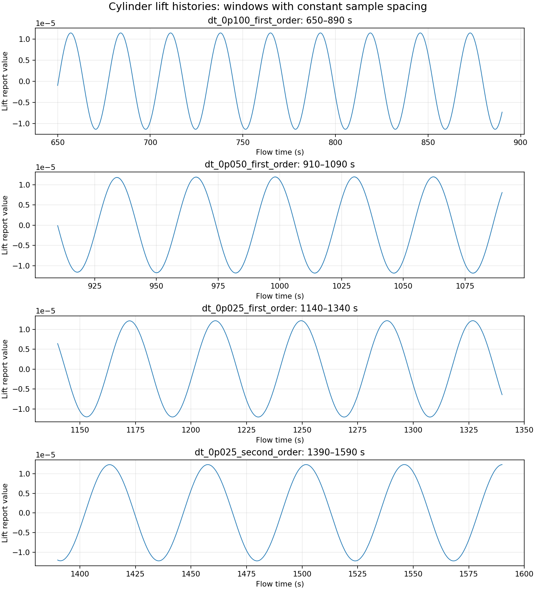
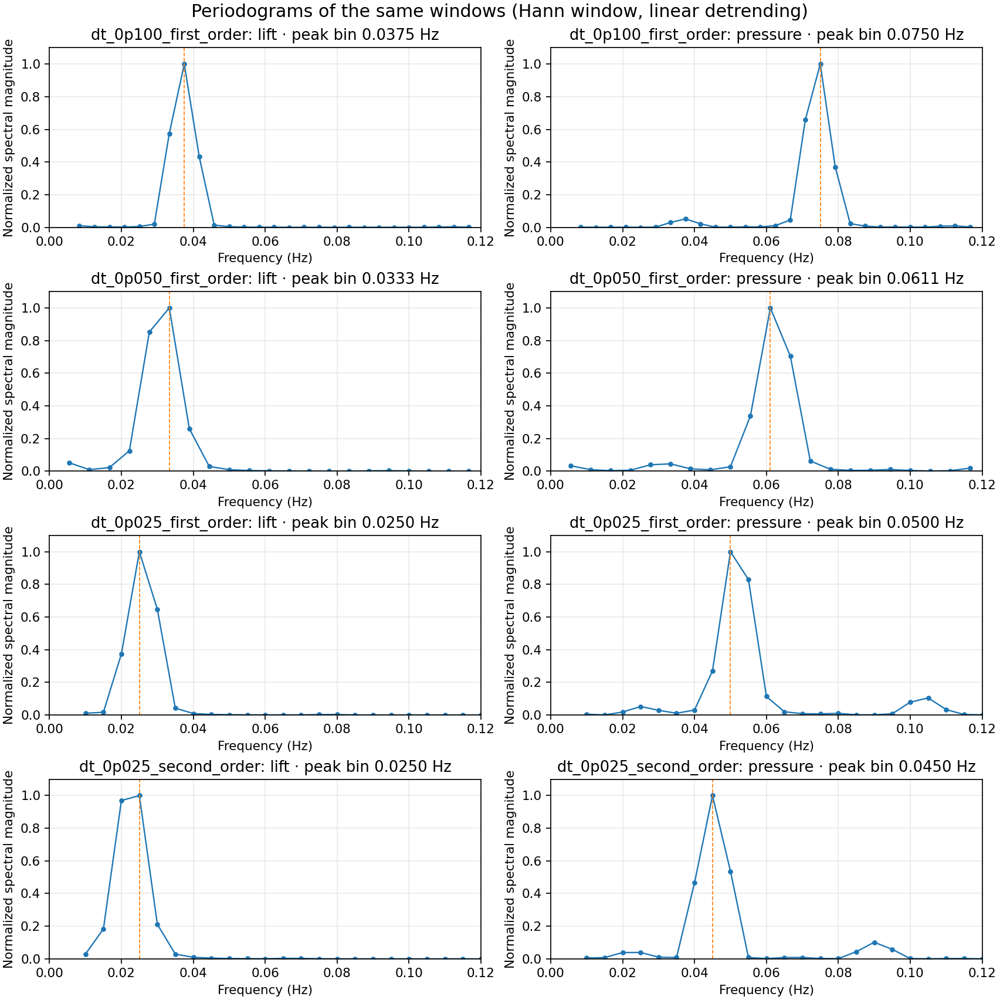

# Cylinder wake: lift, pressure and frequency analysis

**Status:** exploratory CFD study. The frequency has not passed a time-step independence check.

This is an independent learning project in ANSYS Fluent. I simulated transient two-dimensional flow around a circular cylinder, recorded lift and pressure, and used time histories and Fourier spectra to investigate vortex shedding. The main finding is that the pressure signal contains a strong component at about twice the lift frequency. Further checks revealed substantial changes in the lift frequency between successive runs, so I do not claim a validated Strouhal number.

## Case setup

| Item | Setting |
| --- | --- |
| Solver | Fluent 26.1, 2D, double precision, pressure based, transient, laminar |
| Cylinder diameter, $D$ | 0.1 m |
| Inlet speed, $U$ | 0.02 m/s |
| Fluid | Air: $\rho=1.225\ \mathrm{kg/m^3}$; $\mu=1.7894\times10^{-5}\ \mathrm{Pa\,s}$ |
| Mesh | 60,238 cells in the original simulation report |
| Pressure–velocity coupling | SIMPLE |
| Spatial schemes | Second-order pressure; second-order upwind momentum |
| Time scheme | First Order Implicit initially; Second Order Implicit in the final continuation |
| Monitors | Cylinder lift and a wake pressure probe; report files sampled every time step |

These settings give $Re=\rho UD/\mu\approx137$. The original simulation report describes the baseline setup; its time-scheme entry does not describe the later continuation.

## FFT explained with this case

**What the signal means.** The lift report is a list of force values at successive flow times. As vortices shed alternately from the cylinder, the lift rises and falls. A period $T$ is the time between similar peaks. Frequency is the number of cycles per second: $f=1/T$ (hertz). For example, lift peaks in the final continuation are about 44.2 s apart, so $f\approx1/44.2=0.0226$ Hz. This corresponds to one lift cycle every 44.2 s, not 0.0226 cycles per time step.

**What the FFT does.** A fast Fourier transform compares the sampled time trace with oscillations at many frequencies. A high spectral value near a frequency means that frequency contributes strongly to the signal. It does not by itself identify the physical process causing it; that interpretation needs the probe position and an independent signal such as lift. Before transforming a signal, select a section after startup and subtract its mean to remove the constant offset.

**Why the window matters.** A 200 s history resolves FFT frequency bins roughly $\Delta f=1/200=0.005$ Hz apart. Thus a peak in the 0.025 Hz bin can represent a physical oscillation around 0.0226 Hz. Recording every 0.025 s gives a sampling frequency of 40 samples/s and a Nyquist frequency of 20 Hz, far higher than these low-frequency wake oscillations. The long observation *duration*, not the fast sampling rate, limits precision of the low-frequency FFT bin here. Never combine samples from different time-step sizes in one ordinary FFT.

**Why pressure has twice the frequency.** In this setup the pressure probe registers about two similar events during one complete lift cycle. The final window gives $2(0.0226)\approx0.0452$ Hz, close to the pressure peak around 0.0453 Hz. The observed two-to-one relation supports this interpretation for this probe; it is not a rule that every pressure measurement must be divided by two.

**What a spectrum does not tell us.** The vertical-axis quantity depends on Fluent's spectral display settings (for example, magnitude or power spectral density) and on the selected window and normalization. A pressure-spectrum peak height should not be labelled a pressure amplitude in pascals without checking those settings. The comparisons in this README concern **frequency**, not spectral amplitude.

## Signal processing

For each analysis window, I use a section of the monitor history sampled at one constant time step. I compare the lift and pressure spectra over the same physical-time interval. Because FFT frequencies are discrete bins separated by approximately $1/T_{\mathrm{window}}$, I also estimate frequency from the spacing of repeated peaks in the time trace. The latter estimates below are approximate and depend on the selected peaks and window.

The files identify the first change in sampling interval immediately after flow time 890.2 s (step 8,902) and the next immediately after 1090.2 s (step 12,902). Each FFT window stays entirely within one sampling interval.

## Results so far





The plotted spectra are independent periodograms calculated from the included CSV files with a Hann window and linear detrending. Their peak-bin positions can differ slightly from the Fluent FFT screenshots because windowing and the exact sample endpoints differ. The vertical axis is normalized within each panel and should not be read as a physical force or pressure amplitude.

| Run and analysis window | $\Delta t$ (s) | Time scheme | Approx. lift period (s) | Approx. lift frequency (Hz) | Illustrative $St=fD/U$ |
| --- | ---: | --- | ---: | ---: | ---: |
| Baseline, 621.1–890.2 s | 0.1 | First Order Implicit | 26.97 | 0.0371 | 0.185 |
| Continuation, 900–1090 s | 0.05 | First Order Implicit | 32.0 | 0.0312 | 0.156 |
| Continuation, 1140–1340 s | 0.025 | First Order Implicit | 38.6 | 0.0259 | 0.130 |
| Continuation, 1390–1590 s | 0.025 | Second Order Implicit | 44.2 | 0.0226 | 0.113 |

In all four windows, the pressure oscillation is approximately twice the lift frequency. For example, in the baseline window the strongest sampled FFT bins were 0.03715 Hz for lift and 0.07429 Hz for pressure. In the final continuation, the time histories suggest approximately 0.0226 Hz for lift and 0.0453 Hz for pressure. The FFT bin at 0.025 Hz in a 200 s lift window should not be interpreted as a more precise frequency: bin spacing is about 0.005 Hz.

## Checks and limitations

- Lift provides an independent way to interpret the pressure peak. Dividing an arbitrary pressure peak by two would not, by itself, identify shedding frequency.
- The flow-rate check near 1340 s gave inlet about +0.049 kg/s and outlet about −0.049 kg/s, with net around $1.1\times10^{-13}$ kg/s. The internal surface listed in Fluent's flux report is not part of the external inlet–outlet balance.
- The original residual criteria were $10^{-3}$ with at most 20 iterations per time step. A short diagnostic with convergence checking disabled and a 50-iteration cap showed a continuity-residual plateau; the external mass-flow balance remained excellent. Residual behavior alone has not explained the frequency trend.
- **These are successive continuations, not independent time-step runs from a shared starting solution.** The final run also changes the time integration scheme and starts at a later flow time. The frequency changes cannot be assigned uniquely to the time step or scheme from these data.
- The mesh has not yet passed a frequency sensitivity check. No comparison against a benchmark has been established in this study.

## Next controlled comparison

Save a common case-and-data checkpoint and branch two runs from it. Hold the mesh, inlet, solver settings, time integration scheme, inner-iteration settings, and analysis duration fixed; vary only the time step. Compare settled lift periods from equal-duration windows. In a separate paired comparison, hold the time step fixed and change only First Order versus Second Order Implicit. Continue to a mesh check only after these comparisons make the frequency interpretable.

## Repository files

```text
README.md
figures/lift_histories.png
figures/frequency_spectra.png
figures/fluent_fft_screenshots/  (eight renamed Fluent FFT screenshots)
data/dt_0p100_first_order_lift.csv
data/dt_0p100_first_order_pressure.csv
data/dt_0p050_first_order_lift.csv
data/dt_0p050_first_order_pressure.csv
data/dt_0p025_first_order_lift.csv
data/dt_0p025_first_order_pressure.csv
data/dt_0p025_second_order_lift.csv
data/dt_0p025_second_order_pressure.csv
raw/fluent_monitor_snapshots/  (eight renamed original Fluent .out files)
report/original_fluent_simulation_report.pdf
```

Each data filename records its time step and scheme; the first CSV column is physical flow time. The lift CSV retains Fluent's report value without assigning a unit not present in the exported header. The `raw` folder preserves the original Fluent monitor exports as received, with distinct names for the four snapshots of each signal. The screenshot names identify the run and signal; use the CSV windows for reproducible calculations. The original report describes the baseline, not the subsequent continuations. Case-and-data files were not supplied. Add a mesh image when one is available.
