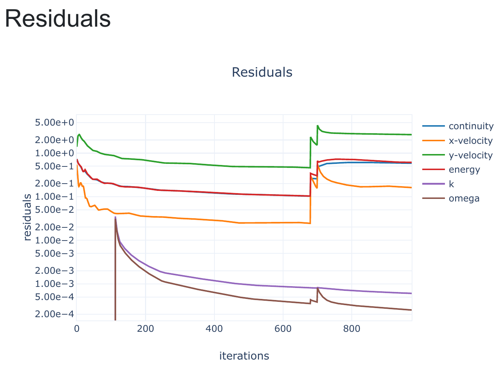
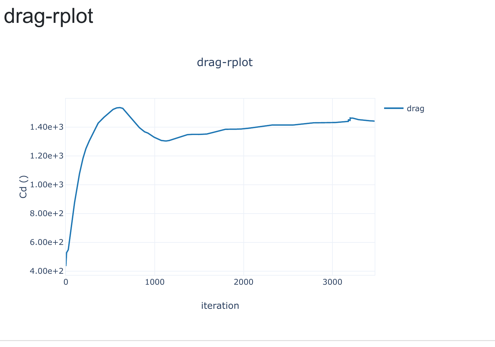

# Hypersonic Aerospike CFD — Mach 6.06

A 2D axisymmetric CFD study of hypersonic flow over a spiked blunt body using **ANSYS Fluent 2022 R1**.

The study is based on the **Model 1 aerospike benchmark** reported by Roveda (AIAA 2009-367) and was carried out while learning high-speed CFD through the **Flowthermolab – CFD of High-Speed Aerodynamics** course.

The main focus of this project was to understand the modelling choices and numerical strategies required to obtain a stable solution for a challenging Mach 6 compressible-flow problem.

---

## Benchmark Conditions

The freestream conditions were taken from the published Model 1 benchmark:

| Parameter          |   Value |
| ------------------ | ------: |
| Mach number        |    6.06 |
| Static pressure    | 1951 Pa |
| Static temperature | 58.25 K |
| Angle of attack    |      0° |

---

## CFD Setup

**Software:** ANSYS Fluent 2022 R1

| Setting             | Selection              |
| ------------------- | ---------------------- |
| Simulation          | Steady                 |
| Solver              | Density-Based Implicit |
| Space               | 2D Axisymmetric        |
| Energy Equation     | Enabled                |
| Turbulence Model    | SST k-ω                |
| Density             | Ideal Gas              |
| Viscosity           | Sutherland             |
| Operating Pressure  | 0 Pa                   |
| Freestream Boundary | Pressure Far Field     |
| Courant Number      | 0.1                    |

### Mesh

The current Fluent model contains approximately:

* **248,405 cells**
* **504,133 faces**
* **255,729 nodes**

Adaptive Mesh Refinement (AMR) was also used during the solution workflow to provide additional resolution in regions of strong flow gradients without uniformly refining the entire computational domain.

---

## Important Modelling Choices

### 1. Axisymmetric Formulation

The geometry represents a body of revolution at zero angle of attack.

Therefore, a **2D axisymmetric** formulation was used instead of a full 3D model.

The centreline was defined using an **Axis** boundary rather than a conventional symmetry boundary.

This significantly reduces computational cost while retaining the axisymmetric form of the governing equations.

---

### 2. Ideal-Gas Density

For hypersonic compressible flow, density changes significantly because of the large variations in pressure and temperature.

Air was therefore modelled as an **ideal gas** rather than using a constant density.

---

### 3. Sutherland Viscosity

The viscosity of air changes with temperature.

Because hypersonic flows involve significant temperature variation, **Sutherland's law** was used for temperature-dependent dynamic viscosity.

---

### 4. Operating Pressure

The Fluent operating pressure was set to:

```text
0 Pa
```

This allows the specified freestream pressure of **1951 Pa** to be used directly in the compressible-flow setup.

---

### 5. Pressure Far-Field Boundary

This project was also my first practical use of a **Pressure Far-Field** boundary condition.

The freestream was specified using:

```text
Mach Number        = 6.06
Static Pressure    = 1951 Pa
Static Temperature = 58.25 K
```

This boundary condition is particularly useful for external compressible-flow simulations.

---

## Solver Divergence and Stabilisation

One of the main learning outcomes of this project was troubleshooting an initially diverging density-based solution.

The first turbulent simulations became unstable within only a few iterations.

Fluent reported:

* excessive temperature changes,
* pressure limiting,
* temperature limiting,
* turbulent-viscosity limiting,
* divergence in the `omega` AMG solver,
* and eventually a floating-point exception.

A gradual solution strategy was therefore adopted.

### Step 1 — Reduce the Courant Number

The density-based Courant number was reduced to:

```text
CFL = 0.1
```

This reduced the aggressiveness of the pseudo-time advancement and improved numerical stability.

### Step 2 — Start with a Laminar Solution

The simulation was initially run without the turbulence model.

This allowed the main compressible-flow field and shock structures to begin developing before introducing the additional turbulence transport equations.

### Step 3 — Activate SST k-ω

After obtaining a stable mean-flow solution, the **SST k-ω turbulence model** was enabled.

The turbulent calculation then remained numerically stable.

This exercise demonstrated the importance of **initialisation, CFL control and continuation strategies** in high-speed CFD.

---

## Adaptive Mesh Refinement

Adaptive Mesh Refinement was used during the solution process.

Hypersonic flows contain thin regions with very large gradients across shocks and expansion structures.

Refining the entire computational domain would substantially increase computational cost.

AMR allows additional mesh resolution to be concentrated in regions where it is most useful while retaining a more economical mesh elsewhere.

---

# Visual Results

## Density Contour

The density field shows strong variations produced by the interaction of the Mach 6 freestream with the aerospike and blunt body.


---

## Residual History

The residual history documents the numerical behaviour of the calculation during the solution process.



The current solution is numerically stable, although the Fluent report does not yet satisfy the specified residual convergence criteria for all equations.

---

## Drag Monitor History

A drag-monitor history was also recorded to assess how the aerodynamic solution evolves during the steady-state calculation.



The plot is currently used only as a **solution monitor**. A final drag coefficient is not reported because the aerodynamic reference values still require verification.

---

## Flow Physics

The published benchmark describes several important structures in this aerospike flow:

* Strong shock generated by the aerodisk
* Rapid expansion behind the aerodisk
* Recirculation behind the disk
* Shear-layer development
* Recompression shocks
* Flow separation along the sting
* Reattachment shock near the blunt forebody

These interacting shock, expansion and separated-flow structures make the configuration a useful benchmark for high-speed CFD.

---

## Current Status

This project is presented as a **benchmark reproduction and learning study**, rather than as a fully validated CFD solution.

The main compressible-flow calculation has been stabilised successfully.

Future work can include:

* Additional convergence assessment
* Mach-number contours
* Static-pressure contours
* Static-temperature contours
* Schlieren / density-gradient visualisation
* Examination of AMR regions
* Mesh-independence assessment
* Near-wall resolution checks
* Quantitative comparison with published surface-pressure data
* Correct aerodynamic reference values and drag-coefficient calculation

---

## Key Learning Outcomes

This project provided practical experience with:

* Hypersonic compressible CFD
* Density-based solvers
* 2D axisymmetric modelling
* Axis vs symmetry boundary conditions
* Pressure far-field boundary conditions
* Ideal-gas density
* Sutherland viscosity
* Operating-pressure selection
* Courant-number control
* Solver-divergence diagnosis
* Laminar-to-turbulent solution initialisation
* SST k-ω turbulence modelling
* Adaptive Mesh Refinement
* Monitoring convergence and aerodynamic quantities

---

## Acknowledgement

This study was carried out while following the **Flowthermolab – CFD of High-Speed Aerodynamics** course.

The course provided the learning framework for high-speed CFD concepts. The simulation setup, troubleshooting, post-processing and documentation shown here represent my implementation of the benchmark exercise.

---

## Reference

Roveda, R., *Benchmark CFD Study of Spiked Blunt Body Configurations*, AIAA 2009-367, 47th AIAA Aerospace Sciences Meeting, 2009.

---

## Tools

`ANSYS Fluent` · `Hypersonic CFD` · `Compressible Flow` · `Density-Based Solver` · `SST k-ω` · `AMR` · `Axisymmetric CFD`
