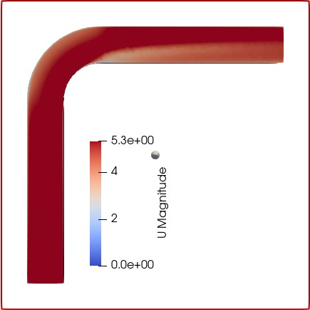

# Open-Source CFD Analysis of Flow Through a 90° Pipe Elbow

## Overview

This project demonstrates an end-to-end CFD workflow using open-source engineering tools to analyse incompressible flow through a 90° pipe elbow.

The workflow covers geometry creation, mesh generation, CFD analysis, and post-processing using:

**FreeCAD → SALOME → OpenFOAM → ParaView**

The study focuses on understanding the effect of the pipe bend on the pressure and velocity fields.

---

## Objectives

The main objectives of this study are to:

* Create a 90° pipe-elbow geometry using FreeCAD
* Generate the computational mesh using SALOME
* Import and prepare the mesh for OpenFOAM
* Perform CFD analysis of internal flow through the elbow
* Visualise pressure and velocity distributions using ParaView
* Interpret the flow behaviour caused by the change in flow direction

---

## Software Used

| Stage             | Software |
| ----------------- | -------- |
| Geometry creation | FreeCAD  |
| Mesh generation   | SALOME   |
| CFD simulation    | OpenFOAM |
| Post-processing   | ParaView |

The project intentionally uses an open-source workflow to demonstrate that a complete CFD analysis can be performed without relying on commercial CAE software.

---

## CFD Workflow

```text
FreeCAD
   ↓
Geometry Creation
   ↓
STEP Geometry
   ↓
SALOME
   ↓
Mesh Generation
   ↓
UNV Mesh
   ↓
OpenFOAM
   ↓
CFD Simulation
   ↓
ParaView
   ↓
Pressure and Velocity Analysis
```

---

## Geometry

The computational domain consists of a pipe containing a 90° bend.

The geometry was created in FreeCAD and exported in STEP format for mesh generation.

Files included:

* `Geom.FCStd` — FreeCAD geometry
* `Geom-Sweep.step` — exported STEP geometry

---

## Mesh Generation

The geometry was imported into SALOME and discretised to generate the CFD mesh.

The mesh was exported in UNV format for use in the OpenFOAM workflow.

Mesh file:

* `Mesh_3.unv`

Including the mesh allows the geometry-to-mesh stage of the analysis to be inspected independently.

---

## OpenFOAM Simulation

The generated mesh was used to perform an incompressible internal-flow CFD analysis in OpenFOAM.

The analysis was used to examine how the 90° bend influences:

* Flow acceleration and redistribution
* Velocity distribution
* Pressure distribution
* Pressure losses through the curved section

---

## Results

### Pressure Distribution


The pressure field changes through the elbow as the flow is forced to change direction.

The curvature of the pipe produces a non-uniform pressure distribution across the bend, demonstrating the influence of geometry on internal-flow behaviour.

---

### Velocity Distribution



The velocity field is redistributed as the fluid travels through the curved section.

The bend modifies the flow structure compared with straight-pipe flow and produces spatial variations in velocity downstream of the elbow.

---

## ParaView Post-Processing

Post-processing was performed using ParaView.

The repository includes:

* `elb.pvsm` — ParaView state file
* `P.jpg` — pressure-field visualisation
* `U.jpg` — velocity-field visualisation

The ParaView state file preserves the post-processing configuration used for visualising the CFD results.

---

## Project Files

| File              | Description                   |
| ----------------- | ----------------------------- |
| `Geom.FCStd`      | FreeCAD geometry model        |
| `Geom-Sweep.step` | STEP geometry                 |
| `Mesh_3.unv`      | SALOME computational mesh     |
| `elb.pvsm`        | ParaView state file           |
| `P.jpg`           | Pressure result visualisation |
| `U.jpg`           | Velocity result visualisation |

---

## Engineering Interpretation

A pipe elbow is a useful CFD case because the change in flow direction introduces behaviour that is not present in fully developed straight-pipe flow.

The bend causes pressure redistribution and changes in the velocity field as the fluid negotiates the curved geometry.

This project demonstrates the complete CFD workflow required to move from CAD geometry to engineering interpretation of simulation results.

---

## Skills Demonstrated

* Computational Fluid Dynamics (CFD)
* OpenFOAM
* ParaView
* FreeCAD
* SALOME
* CAD geometry preparation
* CFD mesh generation
* Internal-flow analysis
* Pressure and velocity post-processing
* Open-source CAE workflow
* Engineering interpretation

---

## Future Development

The project can be extended by including:

* Mesh-independence assessment
* Quantitative pressure-drop calculation
* Velocity profiles at multiple sections
* Turbulence-model comparison
* Validation against analytical or published data
* Automated post-processing using Python
