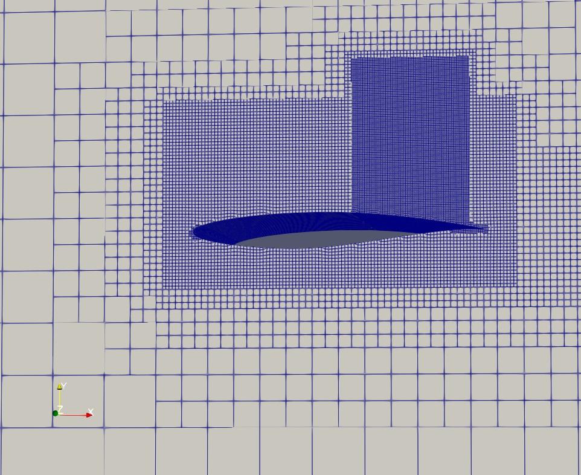
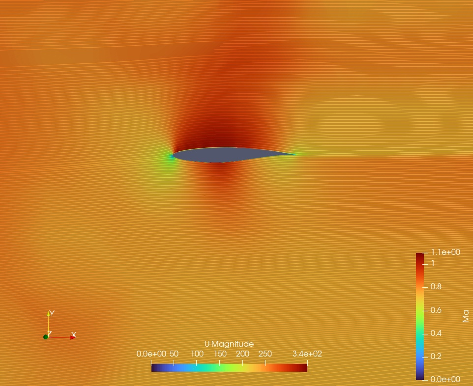
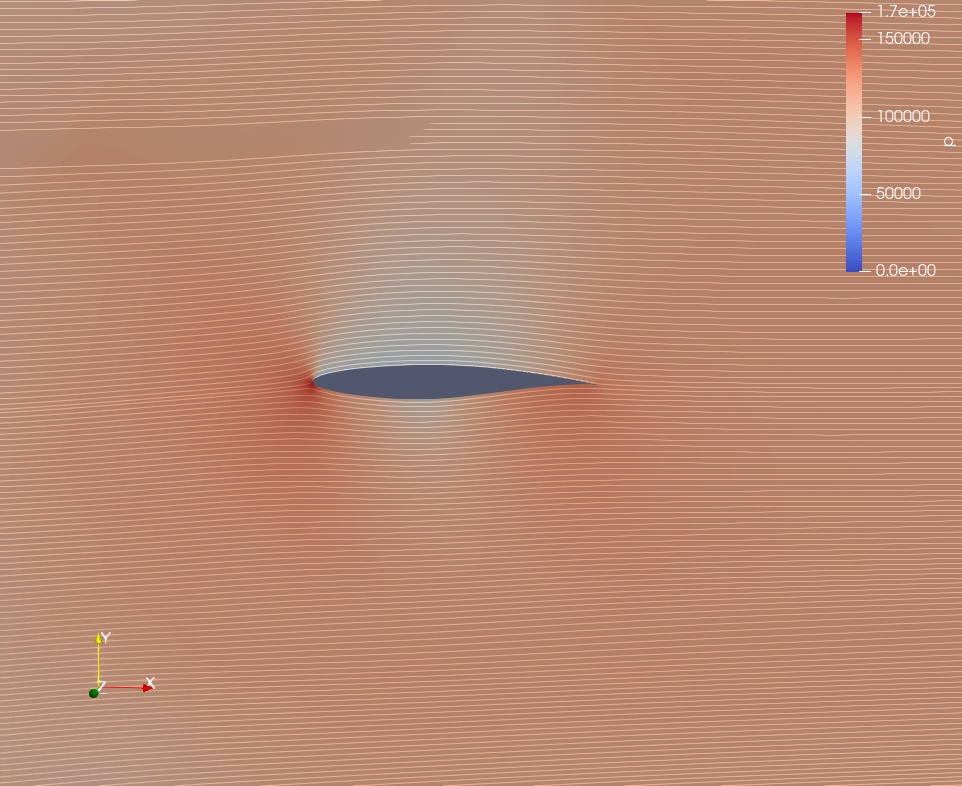

# RAE2822 Transonic Aerofoil CFD — OpenFOAM

## Overview

This project presents a **2D compressible CFD simulation of the RAE2822 aerofoil** under transonic flow conditions using **OpenFOAM**.

The objective of the exercise was to gain practical experience with compressible external aerodynamics, OpenFOAM meshing, far-field boundary conditions, turbulence modelling, and post-processing of transonic flow features.

The simulation shows acceleration of the flow over the aerofoil, development of a locally supersonic region, and subsequent compression over the upper surface.

> **Project origin:** This is a guided learning project completed as part of the **FlowThermoLab – CFD of High-Speed Aerodynamics** course. Credit for the original tutorial framework and course material belongs to FlowThermoLab and the course instructors. The case was executed, inspected, and post-processed by me to develop practical OpenFOAM and high-speed CFD skills.

---

## Case Summary

| Parameter                     |               Value |
| ----------------------------- | ------------------: |
| Aerofoil                      |             RAE2822 |
| Flow regime                   |           Transonic |
| Freestream Mach number        |              ~0.729 |
| Angle of attack               |              ~2.31° |
| Freestream velocity magnitude |          ~233.6 m/s |
| Static pressure               |          108,988 Pa |
| Freestream temperature        |           255.556 K |
| Turbulence model              |             k-ω SST |
| Equation of state             |         Perfect gas |
| Dynamic viscosity             |    1.63 × 10⁻⁵ Pa·s |
| Mesh size                     | ~1.52 million cells |
| CFD software                  |            OpenFOAM |
| Post-processing               |            ParaView |

---

## CFD Setup

### Compressible Air Model

Air was modelled as a **perfect gas**, allowing density to vary with pressure and temperature. This is important in transonic flow because compressibility effects become significant as the local Mach number approaches and exceeds unity.

The thermophysical model uses:

* Perfect-gas equation of state
* `Cp = 1005 J/(kg·K)`
* Dynamic viscosity = `1.63 × 10⁻⁵ Pa·s`
* Prandtl number = `0.72`

### Turbulence Model

The simulation uses the **k-ω SST RANS turbulence model**.

The SST model combines the near-wall behaviour of the k-ω formulation with k-ε-like behaviour away from the wall. It is widely used for external aerodynamic flows involving adverse pressure gradients and possible flow separation.

### Boundary Conditions

The outer computational domain uses OpenFOAM **freestream boundary conditions** for velocity, pressure, and temperature.

The aerofoil surface is treated as a wall with:

* No-slip velocity condition
* Zero-gradient pressure condition
* Adiabatic temperature treatment

The front and back patches are defined as `empty`, making the case effectively **two-dimensional**.

---

## Mesh

The mesh was generated using OpenFOAM meshing tools with progressive refinement around the aerofoil and near-field region.

The final mesh contains approximately **1.52 million cells**.

### Mesh development

The mesh becomes progressively finer close to the aerofoil, where strong gradients in velocity, pressure, and Mach number are expected. Refinement in this region is important for resolving the transonic acceleration and compression features around the aerofoil.

---

## Mach Number Distribution

The Mach-number contour shows strong acceleration of the flow over the upper surface of the aerofoil.

Although the incoming flow is approximately **Mach 0.73**, the local flow accelerates to **supersonic conditions** over part of the upper surface before undergoing rapid compression.

The presence of both subsonic and locally supersonic regions is characteristic of **transonic aerofoil flow**.

---

## Pressure Distribution

The pressure contour shows the corresponding static-pressure variation around the aerofoil.

Acceleration over the upper surface produces a reduction in static pressure. The subsequent compression of the locally supersonic flow produces a strong pressure-recovery region.

The Mach and pressure contours together illustrate the close relationship between flow acceleration, compressibility, and pressure variation in transonic aerodynamics.

---

## Key Learning Outcomes

This project helped me gain practical experience with:

* Setting up **compressible external aerodynamic CFD** in OpenFOAM
* Modelling air using a **perfect-gas equation of state**
* Applying OpenFOAM **freestream boundary conditions**
* Using the **k-ω SST turbulence model** for external aerodynamic flow
* Generating and inspecting locally refined meshes
* Understanding **transonic acceleration and compression**
* Post-processing Mach-number and pressure fields in ParaView
* Interpreting the relationship between Mach number and pressure in compressible flow

---

## Possible Future Improvements

The present project is primarily a guided learning and demonstration case. It can be developed further by adding:

* Surface pressure coefficient (`Cp`) distribution
* Comparison with published RAE2822 experimental data
* Lift and drag coefficient evaluation
* Residual and force convergence histories
* Mesh-independence assessment
* Near-wall resolution and `y+` assessment
* Comparison of turbulence models

These additions would develop the case from a tutorial exercise into a more complete **CFD verification and validation study**.

---

## Acknowledgement

This case was completed while following the **FlowThermoLab CFD of High-Speed Aerodynamics** course.

Credit for the original tutorial and educational material belongs to **FlowThermoLab and the respective course instructors**. This repository entry documents the simulation workflow, CFD concepts, and practical skills developed while completing the exercise.
